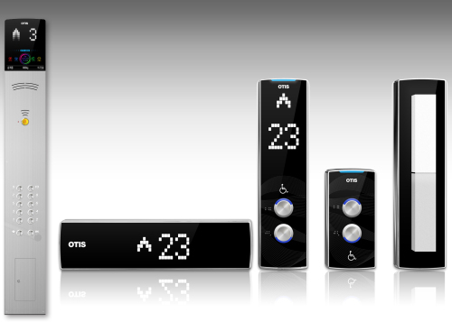

# Elevator HIB Simulator
엘리베이터의 HIB(층 표시기, Hall Indicator Button)에서 출력하는 화살표 모양을 체스보드위에 나타내기

## 소스코드
* [카메라 캘리브레이션](./camera_calibration.ipynb)
* [체스보드에 HIB 화살표 출력](./elevator_hib_simulator.ipynb)

## 카메라 캘리브레이션 결과
* The number of selected images = 10
* RMS error = 0.25276258568391474
* Camera matrix (K) = 
[[1.09072502e+03 0.00000000e+00 6.49201945e+02]
 [0.00000000e+00 1.09056649e+03 3.70281397e+02]
 [0.00000000e+00 0.00000000e+00 1.00000000e+00]]
* Distortion coefficient (k1, k2, p1, p2, k3, ...) = [ 2.96992206e-01 -1.63709577e+00  1.59143714e-03  1.89137957e-03
  3.16860062e+00]

## 비교
| HIB | 체스보드 |
|--------------|-------|
|||
